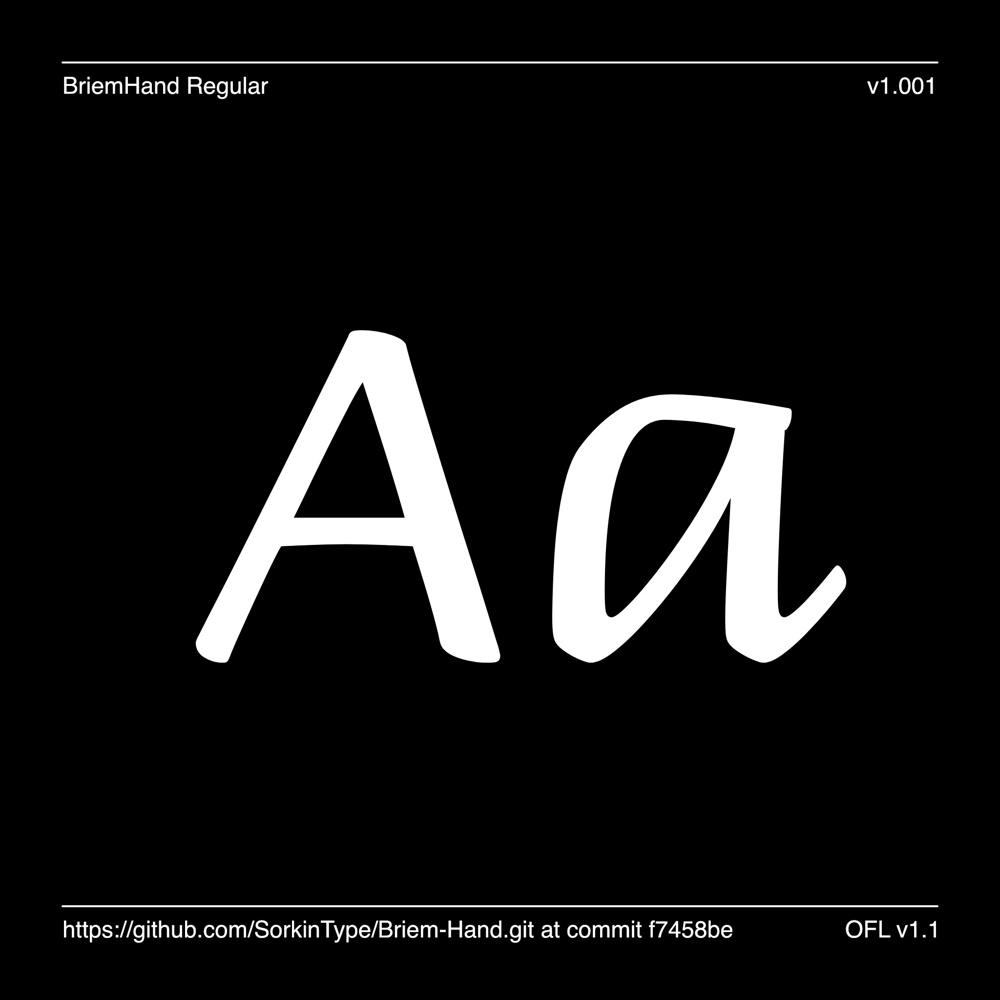

Briem Hand is elegant while also being quite accessible and very legible. It is direct and sincere without being excessively sentimental. It provides a range of weights, and comes with and without guides and joins. Briem Hand is an extended version of Gunnlaugur's 'Briem Script' which was designed in 1992. The Briem Hand is a modern adaptation of sixteenth-century chancery cursive.

Briem Hand includes Latin Vietnamese, Pinyin, and all Western, Central, and South-Eastern European language support, as well as several OpenType features (old-style and tabular figures, superscript and subscript numerals, fractions, stylistic alternates).

Breim Hand support 429 languages of Latin script:
------------------------------
Abron, Abua, Acheron, Achinese, Acholi, Achuar-Shiwiar, Adangme, Afar, Afrikaans, Aguaruna, Ahtna, Akoose, Alekano, Aleut, Amahuaca, Amarakaeri, Amis, Anaang, Andaandi, Dongolawi, Anufo, Anuta, Ao Naga, Apinayé, Arabela, Aragonese, Arbëreshë Albanian, Arvanitika Albanian, Asháninka, Ashéninka Perené, Asturian, Asu (Tanzania), Atayal, Awa-Cuaiquer, Awetí, Awing, Ayizo Gbe, Baatonum, Bafia, Balinese, Balkan Romani, Bambara, Baoulé, Bari, Basque, Batak Dairi, Batak Karo, Batak Mandailing, Batak Simalungun, Batak Toba, Bemba (Zambia), Bena (Tanzania), Biali, Bikol, Bini, Bislama, Boko (Benin), Bora, Borana-Arsi-Guji Oromo, Bosnian, Breton, Buginese, Candoshi-Shapra, Caquinte, Caribbean Hindustani, Cashibo-Cacataibo, Cashinahua, Catalan, Cebuano, Central Aymara, Central Kurdish, Central Nahuatl, Chachi, Chamorro, Chavacano, Chayahuita, Chickasaw, Chiga, Chiltepec Chinantec, Chokwe, Chuukese, Cimbrian, Cofán, Congo Swahili, Cook Islands Māori, Cornish, Corsican, Creek, Crimean Tatar, Croatian, Czech, Danish, Dehu, Dendi (Benin), Dimli, Ditammari, Dutch, Dyula, Eastern Abnaki, Eastern Arrernte, Eastern Maninkakan, Eastern Oromo, Efik, Embu, English, Ese Ejja, Ewondo, Falam Chin, Fanti, Faroese, Fe'Fe', Fijian, Filipino, Finnish, Fon, French, Friulian, Ga, Gagauz, Galician, Ganda, Garifuna, Ga’anda, German, Gheg Albanian, Gilbertese, Gonja, Gooniyandi, Guadeloupean Creole French, Gusii, Gwichʼin, Haitian, Hakha Chin, Hani, Hassaniyya, Hawaiian, Hiligaynon, Ho-Chunk, Hopi, Huastec, Hungarian, Hän, Ibibio, Icelandic, Idoma, Igbo, Iloko, Inari Sami, Indonesian, Irish, Istro Romanian, Italian, Ixcatlán Mazatec, Jamaican Creole English, Japanese, Javanese, Jenaama Bozo, Jola-Fonyi, K'iche', Kabuverdianu, Kaingang, Kala Lagaw Ya, Kalaallisut, Kalenjin, Kamba (Kenya), Kaonde, Kaqchikel, Kara-Kalpak, Karelian, Karo, Kashubian, Kekchí, Kenzi, Mattokki, Khasi, Kikuyu, Kimbundu, Kinyarwanda, Kirmanjki, Kituba (DRC), Kongo, Konzo, Koyra Chiini Songhay, Koyraboro Senni Songhai, Krio, Kuanyama, Kven Finnish, Kölsch, Ladin, Ladino, Lakota, Langi, Latgalian, Latin, Ligurian, Lingala, Lithuanian, Lombard, Low German, Lower Sorbian, Lozi, Luba-Katanga, Luba-Lulua, Lule Sami, Luo (Kenya and Tanzania), Luxembourgish, Macedo-Romanian, Madurese, Makhuwa, Makhuwa-Meetto, Makonde, Makwe, Malagasy, Malaysian, Maltese, Mam, Mamara Senoufo, Mandinka, Mandjak, Mankanya, Manx, Maore Comorian, Maori, Mapudungun, Marshallese, Masai, Matsés, Mauritian Creole, Mbelime, Medumba, Megleno Romanian, Mende (Sierra Leone), Meriam Mir, Meru, Meta’, Metlatónoc Mixtec, Mezquital Otomi, Mi'kmaq, Minangkabau, Mirandese, Miyobe, Mizo, Moba, Mohawk, Montenegrin, Munsee, Murrinh-Patha, Murui Huitoto, Muslim Tat, Mwani, Mískito, Naga Pidgin, Nateni, Navajo, Ndonga, Neapolitan, Ngazidja Comorian, Ngiemboon, Ngomba, Niuean, Nobiin, Nomatsiguenga, North Azerbaijani, North Marquesan, North Ndebele, Northern Kissi, Northern Kurdish, Northern Qiandong Miao, Northern Sami, Northern Uzbek, Norwegian, Nyamwezi, Nyanja, Nyankole, Nyemba, Nzima, Occitan, Ojitlán Chinantec, Orma, Oroqen, Otuho, Palauan, Paluan, Pampanga, Papantla Totonac, Papiamento, Paraguayan Guaraní, Pedi, Picard, Pichis Ashéninka, Piemontese, Pijin, Pintupi-Luritja, Pipil, Pite Sami, Pohnpeian, Polish, Portuguese, Potawatomi, Prussian, Purepecha, Páez, Quechua, Romanian, Romansh, Rotokas, Rundi, Rwa, Samburu, Samoan, Sango, Sangu (Tanzania), Saramaccan, Sardinian, Scottish Gaelic, Secoya, Sena, Seri, Seselwa Creole French, Shambala, Sharanahua, Shawnee, Shilluk, Shipibo-Conibo, Shona, Shuar, Sicilian, Silesian, Siona, Slovak, Slovenian, Soga, Somali, Soninke, South Azerbaijani, South Marquesan, South Ndebele, Southern Aymara, Southern Dagaare, Southern Qiandong Miao, Southern Sami, Southern Sotho, Spanish, Sranan Tongo, Standard Estonian, Standard Latvian, Standard Malay, Sundanese, Susu, Swahili, Swati, Swedish, Swiss German, Syenara Senoufo, Tagalog, Tahitian, Taita, Talysh, Tasawaq, Tedim Chin, Tetum, Tetun Dili, Tigon Mbembe, Timne, Tiv, Tiéyaxo Bozo, Toba, Tojolabal, Tok Pisin, Tokelau, Tonga (Tonga Islands), Tonga (Zambia), Tosk Albanian, Totontepec Mixe, Tsakhur, Tsonga, Tswana, Tumbuka, Turkish, Turkmen, Tuvalu, Twi, Tzeltal, Tzotzil, Uab Meto, Umbundu, Ume Sami, Upper Guinea Crioulo, Upper Sorbian, Urarina, Venda, Venetian, Veps, Vietnamese, Vlax Romani, Võro, Waama, Wallisian, Walloon, Walser, Wamey, Wangaaybuwan-Ngiyambaa, Waorani, Waray (Philippines), Warlpiri, Wasa, Wayuu, Welsh, West Central Oromo, West-Central Limba, Western Abnaki, Western Frisian, Wik-Mungkan, Wiradjuri, Wolof, Xavánte, Xhosa, Yagua, Yanesha', Yangben, Yanomamö, Yao, Yapese, Yindjibarndi, Yoruba, Yucateco, Zapotec, Zarma, Zulu, Zuni, Záparo

## About

Sorkin Type Co. added language support to this design.

## Building

Fonts are built automatically by GitHub Actions - take a look in the "Actions" tab for the latest build.

If you want to build fonts manually on your own computer:

* `make build` will produce font files.
* `make test` will run [FontBakery](https://github.com/googlefonts/fontbakery)'s quality assurance tests.
* `make proof` will generate HTML proof files.

The proof files and QA tests are also available automatically via GitHub Actions - look at https://SorkinType.github.io/Briem-Handwriting.

## Changelog

When you update your font (new version or new release), please report all notable changes here, with a date.
[Font Versioning](https://github.com/googlefonts/gf-docs/tree/main/Spec#font-versioning) is based on semver. 
Changelog example:

**26 May 2021. Version 2.13**
- MAJOR Font turned to a variable font.
- SIGNIFICANT New Stylistic sets added.

## License

This Font Software is licensed under the SIL Open Font License, Version 1.1.
This license is available with a FAQ at
https://scripts.sil.org/OFL

## Repository Layout

This font repository structure is inspired by [Unified Font Repository v0.3](https://github.com/unified-font-repository/Unified-Font-Repository), modified for the Google Fonts workflow.
